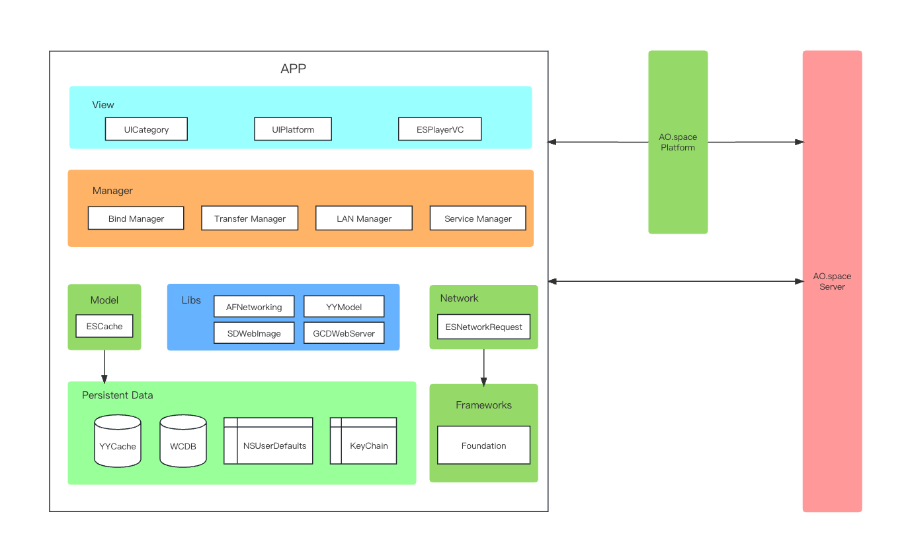

# client-iOS Introduction

English | [简体中文](./README_cn.md)

- [client-iOS Introduction](#client-ios-introduction)
  - [Brief Introduction](#brief-introduction)
  - [Architecture Design](#architecture-design)
  - [Compile and Run Application](#compile-and-run-application)
    - [Get the source code](#get-the-source-code)
    - [Install dependent libraries](#install-dependent-libraries)
    - [Run Application](#run-application)
  - [TestFlight](#testflight)
  - [Contribution Guidelines](#contribution-guidelines)
  - [Contact us](#contact-us)
  - [Thanks for your contribution](#thanks-for-your-contribution)

## Brief Introduction  

The client functions as the system's frontend, granting us with access to all functionalities of the AO.space. It encompasses Web, iOS, Android platforms, providing the following key modules:

- End-to-End Encryption Channel
- Files
- Devices
- Space Application
- Developer Options
- Security

## Architecture Design  

  
AO.space iOS client is developed based on Objective-C language and mainly adopts MVC and MVVM architecture. The open source functions mainly include device binding, file upload and download, transfer list management and other functions. Use DID (Decentralized Identifier) decentralized technology to identify identities.

In the view layer, some functional component classes and category categories are custom-developed based on the view base class in UIKit to facilitate the development of the business side. The source code directories are: `/EulixSpace/ESPlatform/UI` and `/EulixSpace/ESPlatform/Category`.

In the manager layer, there are binding management, Internet/LAN judgment switching module, LAN transmission module, transmission file list module, etc.

In the network layer, a set of HTTP network library was developed based on NSURLSession, combined with YYModel to realize the conversion between data and objects. The source code directories are: `/EulixSpace/ESPlatform/Network`.

In the data layer, the open source libraries YYCache and WCDB are used, and a set of data storage function classes are developed based on YYCache. At the same time, NSUserDefaults and KeyChain are used.

## Compile and Run Application  

### Get the source code

You can use the clone command

  ```
  git clone https://github.com/ao-space/client-ios.git
  ```

  Or get it directly by downloading.

### Install dependent libraries

Some third-party open source library codes are used in the Aospace source code, and the dependent libraries need to be installed before running the project. The specific method is: open the terminal application on the Mac, enter the directory where the source code file is located (the directory where the Podfile file is located), execute the `Pod install` command, and install the third-party open source library that the project depends on.

### Run Application

Open the project file EulixSpace.xcworkspace with Xcode and run the project. The APP uses the camera and can run on the iPhone device, or through the emulator My Mac (Designed for iPhone) to run the program.

## TestFlight

No need to deploy, install and experience immediately

[TestFlight](https://testflight.apple.com/join/fsL70XY5)

## Contact us

- Email: <developer@ao.space>
- Website：[https://ao.space](https://ao.space)
- Discussion group：[https://slack.ao.space](https://slack.ao.space)

## Contribution Guidelines

Contributions to this project are very welcome. Here are some guidelines and suggestions to help you get involved in the project.

[Contribution Guidelines](https://github.com/ao-space/ao.space/blob/dev/docs/en/contribution-guidelines.md)

## Thanks for your contribution

Finally, thank you for your contribution to this project. We welcome contributions in all forms, including but not limited to code contributions, issue reports, feature requests, documentation writing, etc. We believe that with your help, this project will become more perfect and stronger.
