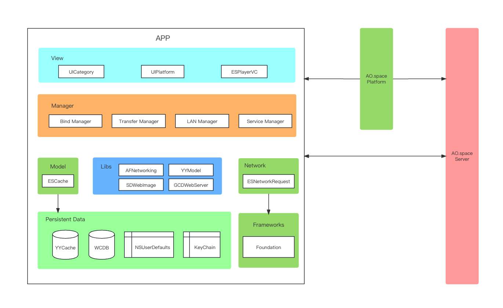

# client-iOS 介绍  

[English](README.md) | 简体中文

- [client-iOS 介绍](#client-ios-介绍)
  - [简介](#简介)
  - [架构设计](#架构设计)
  - [编译与运行](#编译与运行)
    - [获取源码](#获取源码)
    - [安装依赖库](#安装依赖库)
    - [运行](#运行)
  - [安装体验](#安装体验)
  - [贡献指南](#贡献指南)
  - [联系我们](#联系我们)
  - [感谢您的贡献](#感谢您的贡献)
  
## 简介  

客户端是整个系统的前端，负责用户在不同的个人设备上与空间的交互，使用户能够随时随地访问空间的所有功能。目前提供 Web、iOS 和 Android 客户端，提供以下关键模块：

- 端到端加密通道
- 空间绑定
- 文件
- 设备
- 空间应用
- 安全

## 架构设计  

  

AO.space iOS 客户端基于 Objective-C 语言开发，主要采用 MVC、MVVM 架构。开源的功能主要有绑定设备、文件上传下载、传输列表管理等功能。采用 DID（Decentralized Identifier）去中心化技术标识身份。

在视图层，基于 UIKit 中视图基类自定义开发了一些功能组件类和 category 分类，以便于业务方的开发，源码目录分别为：`/EulixSpace/ESPlatform/UI` 与 `/EulixSpace/ESPlatform/Category`。  

管理类方面，有绑定管理、互联网/局域网判断切换模块，局域网传输模块，传输文件列表模块等。  

网络层方面，基于 NSURLSession 开发了一套 HTTP 网络库，结合 YYModel 实现对数据与对象之间的转换，源码目录分别为：`/EulixSpace/ESPlatform/Network`。  

数据层方面，使用了开源库 YYCache 、 WCDB， 基于 YYCache 开发了一套数据存储功能类。同时，使用了 NSUserDefaults 与 KeyChain。  

## 编译与运行

### 获取源码

可以通过 clone 命令方式

 ```
 git clone https://github.com/ao-space/client-ios.git
 ```

 或者直接下载的方式获取。  

### 安装依赖库  

源码中使用了一些第三方开源库代码，在运行项目工程前需要先安装依赖的库。具体方式为：打开 Mac 上终端应用程序，进入源码文件所在目录（Podfile 文件所在目录），执行 `Pod install` 命令，安装项目所依赖的第三方开源库。  

### 运行  

用 Xcode 打开工程文件 EulixSpace.xcworkspace 后 Run 项目。APP 使用到摄像头，可以在 iPhone 设备上运行，或者通过模拟器 My Mac(Designed for iPhone) 来运行程序。

## 安装体验

无需部署，快速安装体验

[TestFlight](https://testflight.apple.com/join/fsL70XY5)

### 通过公共链接邀请安装 Beta 版 App 教程

1. 在用于测试的 iOS 或 iPadOS 设备上安装 [TestFlight](https://apps.apple.com/us/app/testflight/id899247664)。
2. 在设备上轻点公共链接：[https://testflight.apple.com/join/fsL70XY5](https://testflight.apple.com/join/fsL70XY5)。
3. 如果你是第一次测试该 App，轻点“接受”。
4. 轻点“安装”，将 App 安装到设备上。
5. 如果你不是第一次测试该 App，轻点“更新”或“打开”。

## 贡献指南

我们非常欢迎对本项目进行贡献。以下是一些指导原则和建议，希望能够帮助您参与到项目中来。

[贡献指南](https://github.com/ao-space/ao.space/blob/dev/docs/cn/contribution-guidelines.md)

## 联系我们
- 邮箱：<developer@ao.space>
- 官网：[https://ao.space](https://ao.space)
- slack 讨论组：[https://slack.ao.space](https://slack.ao.space)

## 感谢您的贡献

最后，感谢您对本项目的贡献。我们欢迎各种形式的贡献，包括但不限于代码贡献、问题报告、功能请求、文档编写等。我们相信在您的帮助下，本项目会变得更加完善和强大。
